# Ender- 3 Pro Failed Assembly

Documenting a failed attempt. Printer and original components fresh from Amazon. Hopefully I made a mistake somewhere!

## Wiring
Following guidelines from 

### Hotbed and hotend connected
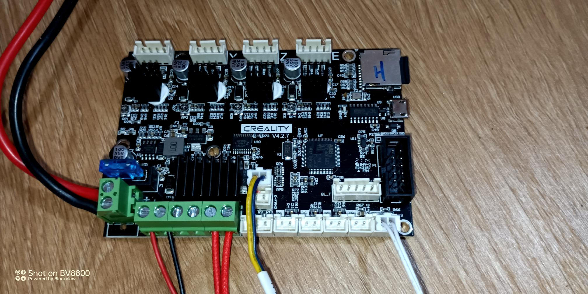

### X Sensor connected
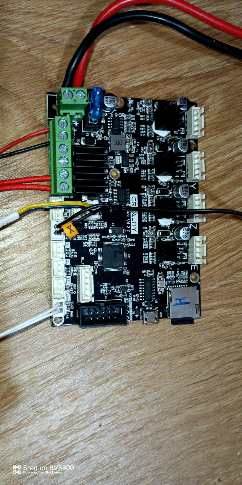

### Y Sensor connected
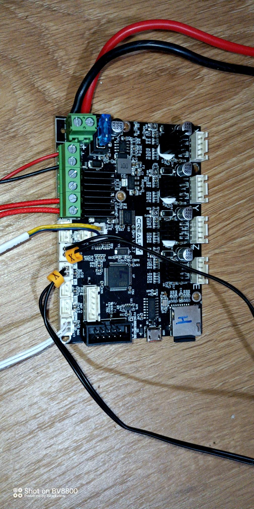

### Z Sensor connected
Removed, the CR Touch will handle it

### X Motor connected
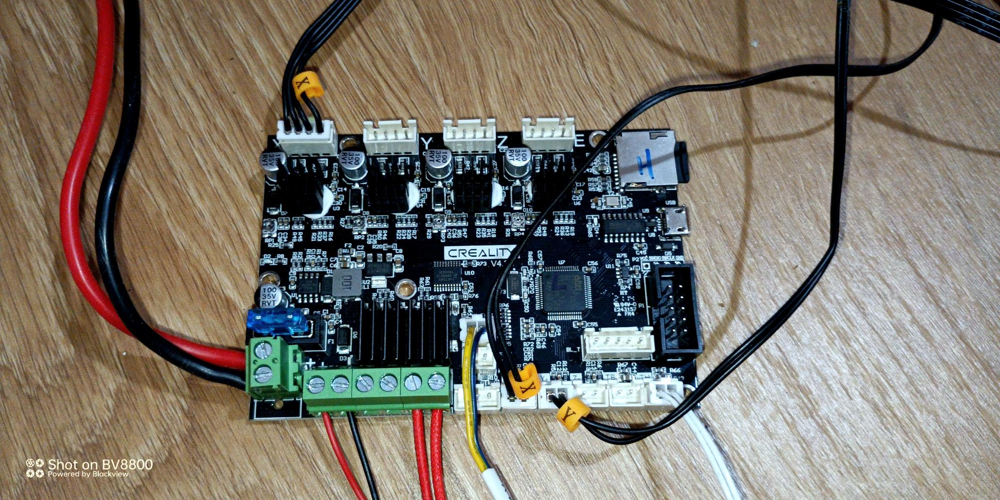

### Y Motor connected
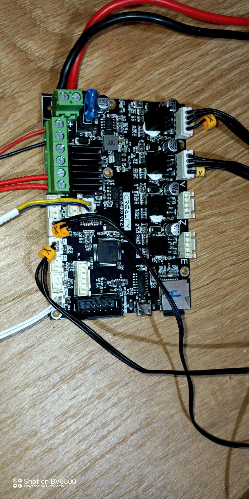

### Z Motor connected
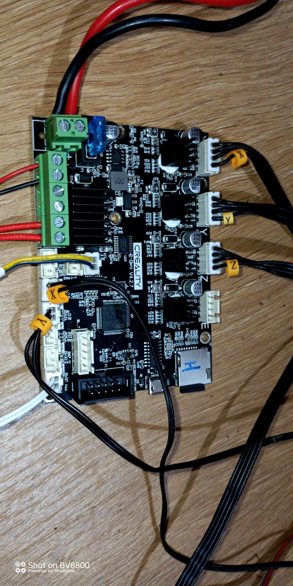

### E Motor (extruder) connected
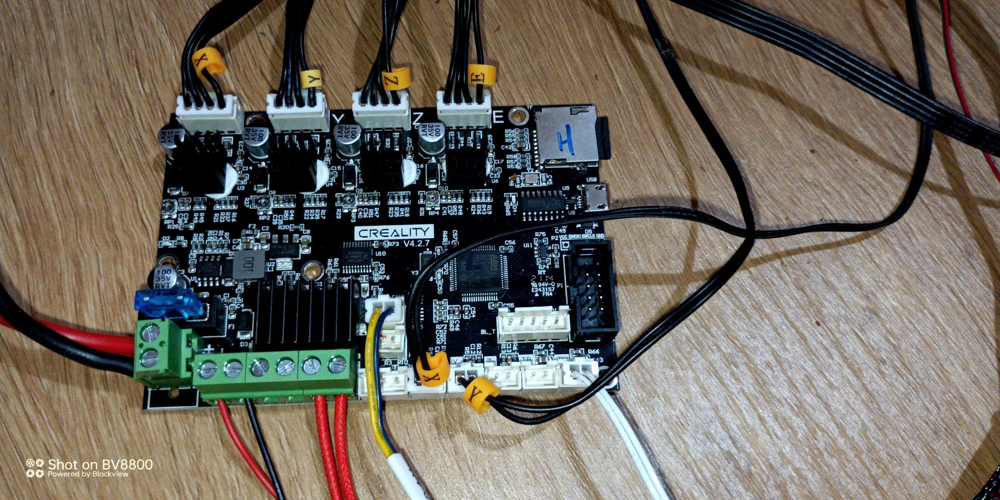

### CR Touch connected
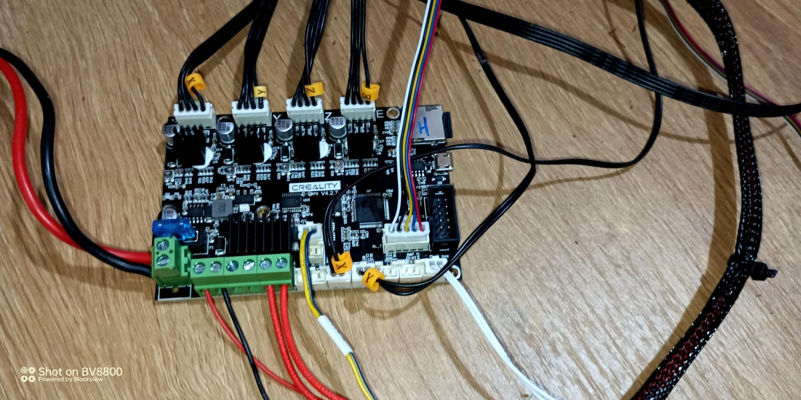

### Hotend sensor connected
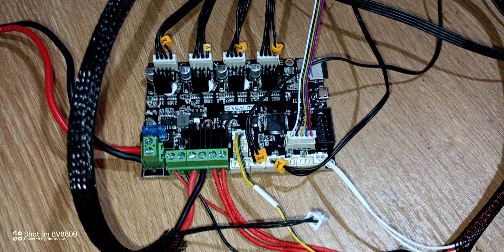

### Bed sensor connected
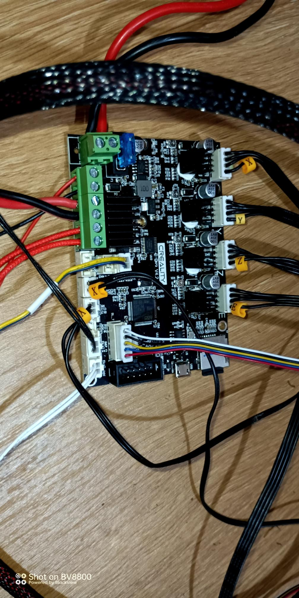

### Screen connected
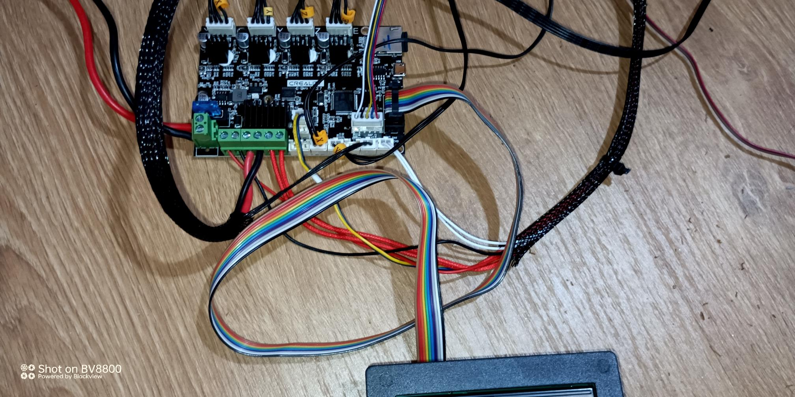

### Final assenbly
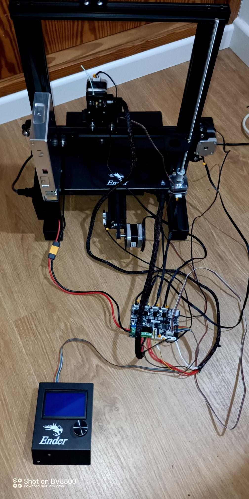

## Formware
### Download
From [Official downlads](https://www.creality.com/pages/download-ender-3-pro?spm=..page_1934481.products_display_1.1)
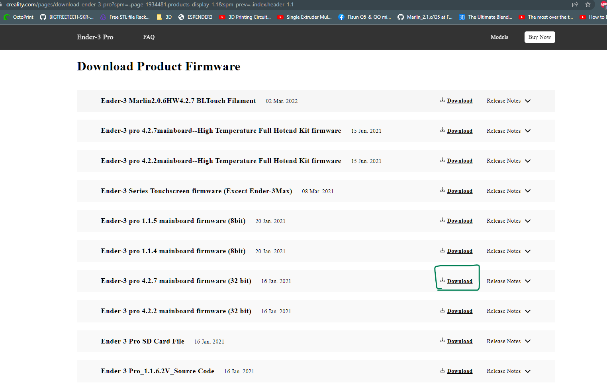

### Unpack
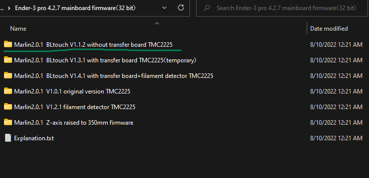

### Format SD Card
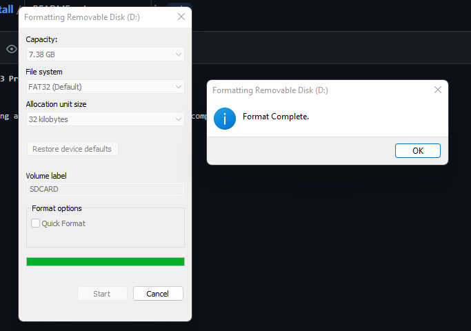

### Copy firmware file to SD Card
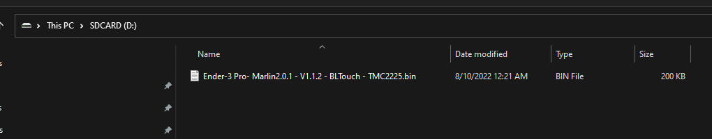

### Rename file
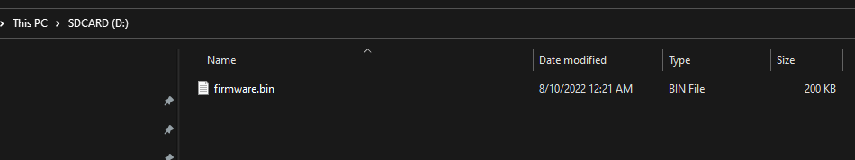

## Also tested with:
 - Creality Ender 3 2.2.7 Silent Board
 - BTT SKR Mini E3 V2.0
 - BTT TFT35-E3
 - Creality 3D Pad

 # Result

